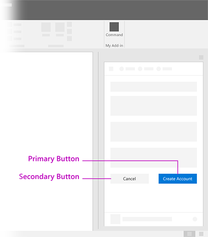
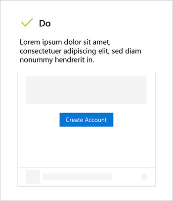
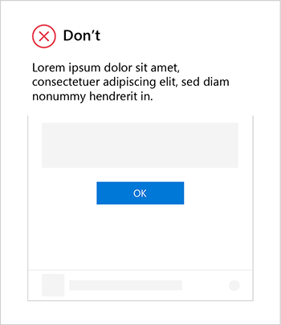
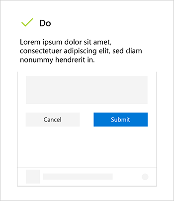
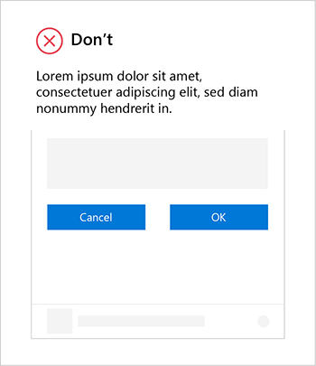

# Buttons For Add-ins

## Overview

Buttons are best used to enable a user to commit a change or complete steps in a task. They are typically found inside forms, dialogs, panels or pages. An example of their usage is confirming the deletion of a file in a confirmation dialog.

When considering their place in a layout, contemplate the order in which a user will flow through the UI. As an example, in a form, the individual will need to read and interact with the form fields before submiting the form. Therefore, as a general rule, the button should be placed at the bottom of the UI container (a dialog, panel, or page) which holds the related UI elements.

While buttons can technically be used to navigate a user to another part of the experience,this is not recommended unless that navigation is part of an action or their flow.
  
#### Task Pane Example

## Best Practices

Lorem ipsum dolor sit amet, consectetuer adipiscing elit, sed diam nonummy nibh euismod tincidunt ut laoreet dolore magna aliquam erat volutpat. Ut wisi enim ad minim veniam, quis nostrud exerci tation ullamcorper suscipit lobortis nisl ut aliquip ex ea commodo consequat.  

## Variants

#### Default Button

* Lorem ipsum dolor sit amet, consectetuer adipiscing elit.
* Lorem ipsum dolor sit amet, consectetuer adipiscing elit.

#### Primary Button

* Lorem ipsum dolor sit amet, consectetuer adipiscing elit.
* Lorem ipsum dolor sit amet, consectetuer adipiscing elit.

#### Compound Button

* Lorem ipsum dolor sit amet, consectetuer adipiscing elit.
* Lorem ipsum dolor sit amet, consectetuer adipiscing elit.